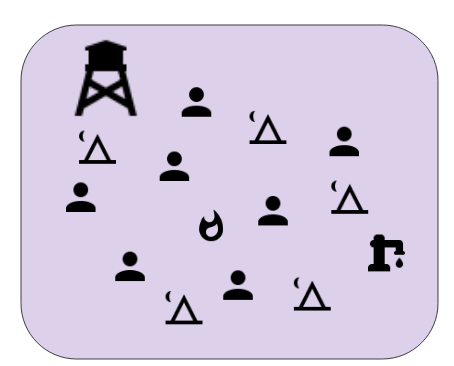
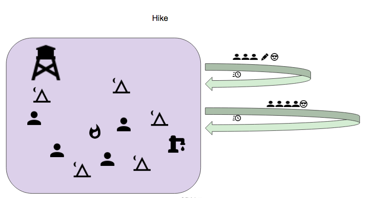

# Deprecated - The Journey Model

### 

# Problems we had / What did we want to solve?

## Problems:

*   Complicated structure to our roadmap, sometimes we had 3 - 4 lanes happening at the same time, sometimes just 1… started to feel we were having a fake constructs of teams, where one team worked on 1 thing and the other worked on 3 different things at the same time.
*   Knowledge sharing between the teams was difficult, people were stuck in their silo and didn’t see what’s going on the other part of the bigger team.
*   We never had time to modernise or try new things out, 2 team structure made it feel like there are always enough products to work on and allocating people to do something new will just not work, unless the entire team is allocated (which is also not what Engineering Manager / Team might want) 
*   We are working in a dynamic industry and also with clear lack of resources (to tackle what we are trying to) - We are in a never ending race to produce and we never find the time to work on our infrastructure (aside from fire fighting)

The problems stated above are not all of our problems of course, these are just the ones we decided to surface and that we felt are more pressing right now.

We can’t solve all of our problems! That we know… so we mapped what are the problems we do want to solve.

## The problems we wanted to solve

*   Be able to allocate **the right amount of people** to work on a product / project
*   Be able to form a team around a technical difficulty we have (outside the roadmap) / tech improvements we need to do, in a planned manner and not just firefighting.
*   Have one goal per team to solve - currently they are having multiple goals we're chasing in parallel which adds to confusion.
*   Be able to share knowledge within the bigger Wikidata group.
    *   A goal would be that the 1 man silo would become a group silo, it’s not a perfect solution, but it’s a start in the right direction.

The idea is to try and solve the problems that are bugging us and from there came the idea to try a version of the Spotify model. The idea is to use the Spotify chapter model as an interface, but implement it in a way that works better for us, the entire “vertical” / “horizontal” wasn’t needed for us, as we don’t have dev-ops and all of the engineers are full-stack.

## Other solution considered:

Splitting into 3 teams, continue with static team structure

1. Wikidata Feature Team
2. Lexeme Feature Team
3. Infrastructure / Maintenance Team

**What problems would that solve?**

This model would have given us a more dynamic way of working, creating 2 feature teams (Lexeme and Wikidata) and one Infrastructure team (mostly to work on core issues and maintenance).

This would also fit more our current roadmap and way of working and would have reduced the Ministry of Magic’s workload by taking 2 developers to focus only on Infrastructure while the rest are still doing feature work.

**What wouldn’t it solve?**

Knowledge sharing wouldn’t have improved and probably worsened by this, as this creates another team silo.

**What issues would come with it?**

Creating a Maintenance / Infrastructure team is problematic to say the least, it’s a team that will do the work that no one wants to do, developers working on these type of teams tend to quickly want to move out after a duration of time.

## A bit of context

First, we played with wordings, generally we asked how words affect culture?

We thought we want to avoid the term **team**, as it comes with previous terminology - a team for us until now is a long running team.

There was a need from our side to make it clear that a “team”:

*   Has one clear goal 
*   Formed and disbanded when a goal is achieved
*   Collects learnings from their _journey_ ;) 

And that’s how the **journey** metaphor started. A “team” became “Hikers”, “Trail Blazers” or “Campers” to fit to the journey metaphor, but also to describe the difference between them using one word.

Before we start getting into the details, let’s understand the terms we use

# Glossary + Metaphors

**Campers (Metaphors)**

*   The camp is our home - we all belong there
*   We need to make sure it could grow to our needs and contain what our hikers are bringing in
*   Our camp should be strong enough to handle rain and even rainstorm and campers should prepare for those scenarios

**Hikers (Metaphors)**

*   A group of people going off camp for a limited amount of time for a journey.
*   They have a **goal** to achieve and a **clear map**.
*   They will return to the camp at the end of the hike with their findings and knowledge
*   They can invite people from other camps to join their hike
*   A group of hikers will choose one person to navigate or decide that the whole group would share that responsibility 

**Trail Blazers (Metaphors)**

*   A group of people going off camp for a limited amount of time for a journey.
*   The have a **goal** to achieve, but they **don’t have a map** and they **need to find a way**.
*   They will return to the camp at the end of the journey with their a result or findings and knowledge, or come with learnings of why the path wasn’t right.
*   A group of trail blazers will choose one person to navigate or decide that the whole group would share that responsibility 

**Journey** An act of travelling, in our case to achieve something. Journeys have goals.

*   **Hike - journey with a clear map**
*   **Trail blazing - journey without a map**

**Navigator** - A journey member that holds the map that was given to the group and funnels information from the team to the outside world and vice versa.

Ideally the navigator takes care of the team’s processes. (A navigator is not a must and the entire team can share that responsibility).

**Bonfire meeting** - A meeting that takes place in camp, before a journey starts. The Wikidata camp is talking about the coming journey and decides who goes to the journey and who will be the navigator (or if they need one).

*   In the bonfire all involved parties of the journey should attend: Engineers, Product Manager, UX/Com/Architect (if needed).

**Smores meeting** - A meeting that takes place in camp, after a journey has ended, The Hikers / Trail blazers are talking about what they did, what they achieved and what they learned from their journey.

*   Suggested structure: scope of the journey, approach, what was completed, lessons learned, next steps
*   Make sure to include screenshots
*   Hikers should know who’s going to talk when about what, ideally do a dry-run first

**Story Time**- A meeting that takes place at the campsite, on the hikes and on the trailblazers. The goal of this meeting is to decide the stories/tickets that will be taken care of in the “round” - that is the next iteration for the journeys and the tailblazers and the next time frame for the campsite.  For that purpose the tickets/stories ready for development will be discussed one by one, estimated, and among all of them prioritized.

If the discussion of a story/ticket reflects that there’s still some clarification needed, that story will not be estimated. The steps to get it clarified will be decided on the spot e.g. “who asks whom what”

The estimation of the stories/tickets will follow this [guideline](https://github.com/wmde/JourneyModel/blob/master/DEFINITIONS.md).  If after the first estimation there are significantly different opinions, one of the people with the highest one and one of the people with the lowest one will expose their reasons. A discussion might follow. Then everyone will estimate again until there is a consensus: either the new estimations are all the same or they agree to meet in the middle and go for the average.

If there’s no agreement on the estimation the team must address what is causing that.

**Task Breakdown** - This meeting takes place potentially in all of the journeys (hikes, trailblazers and campsite). Its goal will be to decide whether the tickets/stories to tackle should be broken into smaller pieces e.g. in case parallelism is possible/needed or simply makes it easier and a collaboration is needed or wished for… or it stays as a whole.

**Retrospective** - This meeting will take place locally for the campsite, the hikes and the trailblazers. A global camp retrospective (that include all campers) also takes place, with lower frequency than the local ones.. The goal of this meeting is to keep on the good practices and learn from the bad ones and change these. The structure is described in more depth in the following [document](https://github.com/wmde/JourneyModel/blob/master/RETROSPECTIVE.md).

**Daily** - This meeting will take place locally for the campsite, the hikes and the trailblazers on a daily basis - same as an Stand Up meeting. Everyone shares (1) what they did the day before, (2) what they plan to do for the day, (3) whether there are any blockers in their way, (4) whether they need help from someone. In the end of the meeting it will be made clear who needs/wants to do some pair programming in that day.

# In Practice

## Campers

Campers will…

*   do maintenance work and bug fixes
*   finish loose ends of other features if needed 
*   work in kanban and will follow the process Ministry of Magic team has established and works well (see campers process below)
*   Campers / Engineering Manager can (and are encouraged to) create a Trailblazers team to tackle big maintenance issues / tech innovation they want to try and have a kickoff meeting and try to form their journey
*   There must always be **1.2 FTEs on camp (on average - they can still take holiday etc..)**

### Campers process: 

*   Daily - ✔ - 
    *   Every workday
*   User Stories - ✔
*   Story Time - Once a week, 45 minutes
*   Task Breakdown - Once a week, 45 minutes
*   Commitment - ✔ - Take task from highest prio User Story
*   Iteration - ❌- No need, as Campers are working in a reactive model.
*   Retrospective - ✔ - Every 2 weeks, 60 minutes.

## Hikers

### Hikers will…

*   form around a product on the roadmap 
*   not last more than 1Q to avoid long running teams
*   work in Scrum and follow the turtles process
*   form in a **kickoff meeting (Bonfire meeting)** driven by a **Product Manager** where the **developers can decide whether they want to join a hike** and who else there is needed
*   Hikers can invite other non-engineers to join a hike (UX for example) for limited amount of time or for the full hike. 
*   If we need to hike but a hike doesn’t form - then the Engineering Manager can choose the hikers for a journey
*   Possible hikers should state their planned unavailability before the hike team is formed, allowing for more accurate grasping of actual resources available \

*   Hikes are not limited by amount of people as long as the camp is protected.
*   Hikers are obligated to help campers with maintenance / bugs tasks while being on hike (**20% of their time**) as consultation only (code review / knowledge sharing, but **not to solve the problems**)
*   If a hike is longer than a quarter, the hikers will break apart and meet for a new bonfire meeting and reform
    *   Some of the original hikers will stay
    *   New hikers will join 
    *   Goals: 
        *   To improve knowledge sharing 
        *   Be able to react to changes (we might need more / less people)
        *   Avoid long running hikes
        *   Adding new perspective to the hike.
*   Product Manager is a part of any hike and acts as a member of the hike’s rituals 
*   Several hikes can happen at the same time
*   A hiker is a part of one hike only at a time

### Hikers Process:

*   Daily ✔ - 
    *   Every workday
*   Iterations ✔ - 
    *   Team’s decision: every 14 to 21 days
*   Sprint Start Meeting ✔  - Also might be emergency story time
*   Story Time ✔ - 
    *   Once a week (30 minutes) 
*   Task Breakdown ✔ - 
    *   Once a week, 45 minutes
*   Commitment - ✔ - 
    *   Finish what we picked up on the Sprint board
*   Retrospective - ✔ - 
    *   Every 2 weeks, 60 minutes.
    

## Trailblazers

### Trailblazers will…

*   form around a technical debt / technical difficulty 
    *   Technical debt - recurring maintenance work that seems never ending (fire fighting and such) that needs to be solved from the root.
    *   Technical difficulty - answer the question, "can we do that?" for assumptions we have, but we never tried.
*   not last more than 1Q to avoid long running teams
*   work in Scrum and follow the turtles process, but without User Stories or Story Time. These will be replaced by Exploratory Time And Tasks.
*   Campers are encouraged to suggest a trailblaze journey in order to find a good solution to recurring maintenance issues
*   Anyone can make a case for a trailblaze journey
*   A trailblaze journey is **led by anyone** and not exclusively by engineers / product 

### Trailblazers Process: 

*   Daily ✔ - 
    *   Every workday
*   Iterations ✔ - 
    *   Team’s decision: every 14 to 21 days
*   Sprint Start Meeting ✔  - Also might be emergency story time
*   Exploratory Time (Similar to Story time, only these are not user stories) ✔ - 
    *   Once a week (30 minutes) 
*   Task Breakdown ✔ - 
    *   Once a week, 45 minutes
*   Commitment - ✔ - 
    *   Finish what we picked up on the Sprint board
*   Retrospective - ✔ - 
    *   Every 2 weeks, 60 minutes.

## How does the entire thing work?

Lifecycle of this process:

Campers are working on camp, a **kickoff meeting** begins and all the members of the big Wikidata camp are invited to join.

Product Manager / Engineering Manager will have a **kickoff meeting** for a feature set / Product with a goal and epics (for hikers)

After the kickoff meeting there will be **bonfire meeting**, where the camp will decide who will join the **hike** / **trailblazing**.

Each **journey** will need to have a **navigator** from the engineers,  a person that will make sure the process is working well and funnel information to the Product Manager / Engineering Manager and try to be the voice for the team in case unclarities arise.

**Anyone** can form a kickoff meeting and try to convince the group why their idea is compelling and why people should join a **trailblaze** for that idea/goal, EM will have a final say when those will start / whether it’s something that should start.

If a **hike / trailblazing** takes **longer than a quarter**, the members of the journey shall **disband** and meet for another **bonfire meeting** and will recruit new members / some will leave… this is to improve **knowledge sharing**, add **new perspective** / **ideas** to the current journey and generally **asses again the amount of people needed** for this journey.

During a journey a **scrum process** is in place, in the beginning of a **hike’s / trailblaze’s** lifecycle there will be a **journey start meeting** where all the boards will be created by the Engineering Manager and those who are going on the **journey** will set their **scrum meetings times**. The **Journey navigator** will act as the **process master**.

Members of the Wikidata camp are **strongly encouraged** to say **no** if they feel that a **journey is not well prepared**, a **journey** will only work if the **goals are clear**.

**Campers will work in Kanban** and will mostly do maintenance work, minor features and bug fixes that are not related to ongoing journeys.

They should use the **20% consultation** time that the hikers / trailblazers reserve to get help on **how to solve the things they are working on, but they have never seen before.**

Aside from each individual journey’s retro, there will be a **Journey model retro** for the **entire Wikidata camp every 4 weeks**, to iron out everything and assess how is this thing working for us. **In this meeting EM + PM and ComCom will participate**.

# What are the challenges?

*   Team forming takes time and might lead to slow starts in projects
*   Process around this needs to be air tight, hikes starting without clear goals and clear path will be doomed to fail
*   Puts a lot of pressure on the product work
*   The more journeys we have the more complicated it gets to EM to track what’s going on
    *   Either being a member of all the dailies which will take time or not being a part of them, which means find a new way to gather the information

# Recap of this model’s benefits

*   Hikers / Trailblazers will focus on one thing, which will reduce interruption time and will increase quality of work and focus
*   Dynamic model allows the camp to accept more work just by forming a new hike
*   Knowledge sharing is integrated into the process, in the 20% consultation time and in the dynamic switch of teams
*   Forces clear goals before hike / trailblazing forms and works with the Kickoff concept of new products
*   Creates an opening to invite UX to join our journeys 
